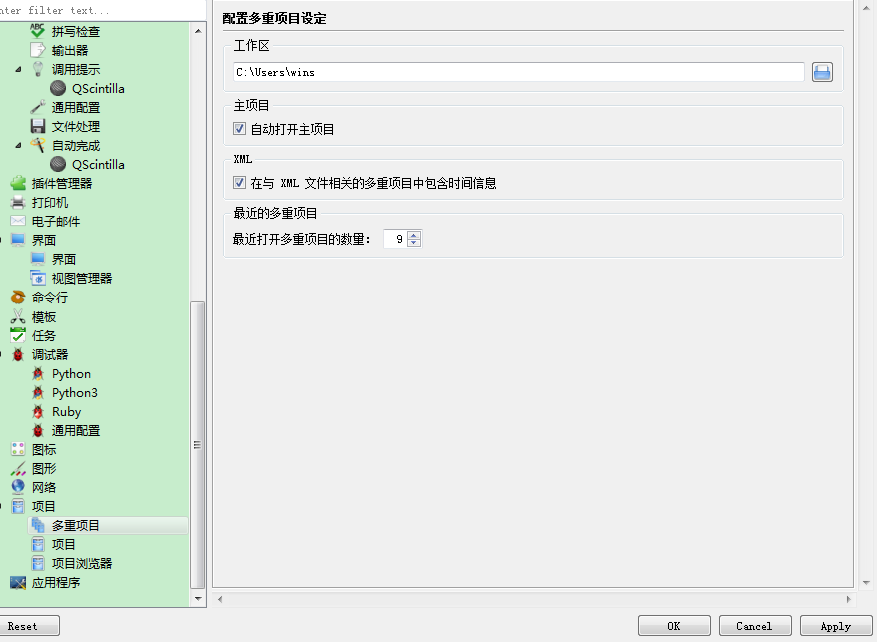
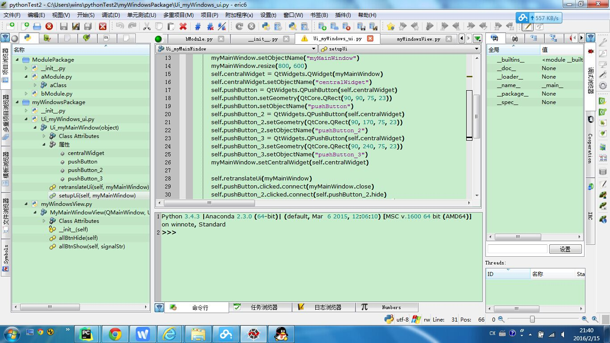

.. highlight:: rst

Eric配置
==========

作为一个初学者，第一步就是搭建python的开发环境，因为我是要用pyqt包写界面的，在网上看了写文章，都是用Eric 5开发的，那么最初使用的就是Eric，Eric配置没有特别需要说明的

Eric有中文的语言包，可以下载语言包。
运行eric6.pyw不显示console窗口，运行eric6.py会显示console窗口

Eric运行的界面如下：

