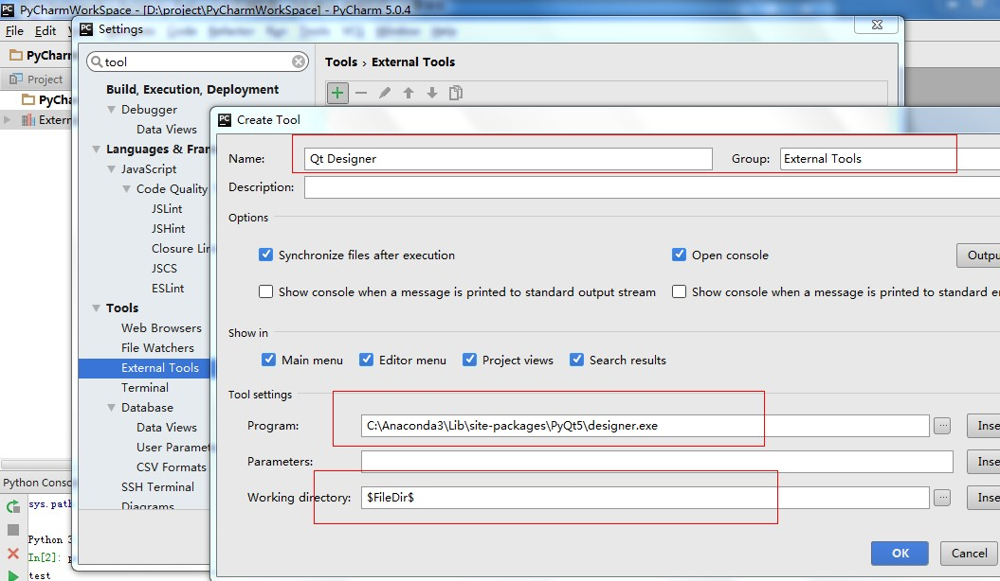
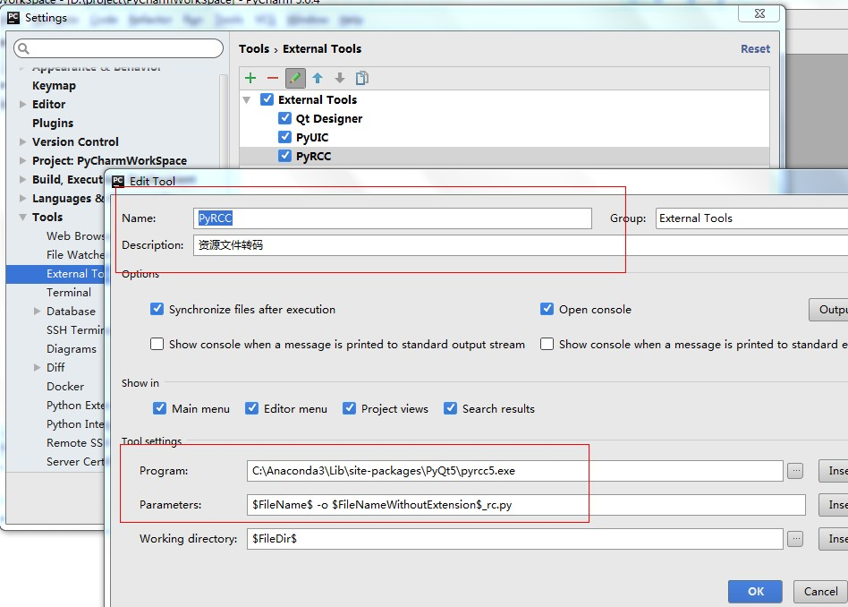
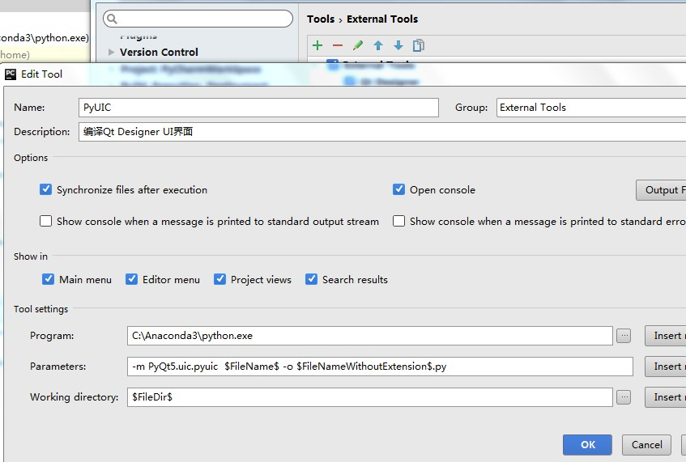
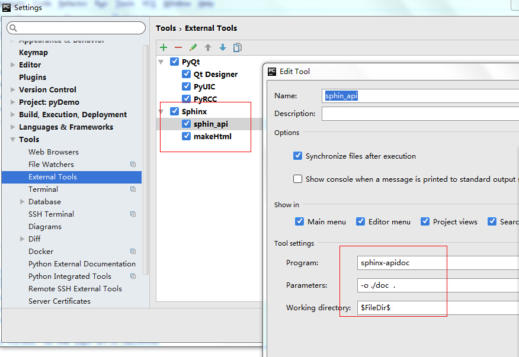
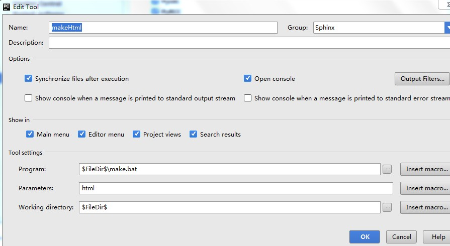
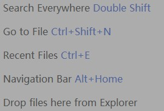

.. highlight:: rst

PyCharm配置
================

PyCharm介绍
----------------

PyCharm配置
----------------

最初的几个PyQt例子都是用Eric编写的，但是Eric的代码提示功能不够强大，对于我这样的新手而言确实有点麻烦，看到很多人都推荐用PyCharm，用下来真心强大，推荐新手都从PyCharm开始学习，完善的代码提示能少走很多弯路。
PyCharm调用Qt Designer是通过配置Extern tools实现的。本文配置了以下几个Extern Tools。

  - 配置Qt Designer

  - 配置Pyqt 资源转换工具

  - 配置pyqt转换*.ui文件到*.py

  - 配置Sphinx生成api接口

  - 配置Sphinx 生成html文件

PyCharm快捷键:

下面是PyCharm界面截图，截图时正在写本篇笔记

.. image:: images/PyCharm5.jpg

